# Infinite Chess

A chess variant played on a lemniscate (figure-eight) board, where pieces can orbit the loops.

## Features
- **Modern Tech Stack**: React (TypeScript) + Django Channels.
- **Anonymous Matchmaking**: Real-time pairing without user accounts.
- **Infinite Topology**: A board where straight lines can return to their origin.

## Development

### Backend
1. Install [uv](https://github.com/astral-sh/uv).
2. `cd apps/backend`
3. `uv sync`
4. `uv run python manage.py runserver`

### Frontend
1. `cd apps/frontend`
2. `npm install`
3. `npm run dev`

## Architecture
- Matchmaking is handled in-memory by Django Channels.
- Game state is synchronized via WebSockets.
- Board is rendered as a responsive SVG path for non-Euclidean movement.

## Movement Examples & Coordinate Geometry
The unique lemniscate shape alters the standard movement paths and coordinate geometry. 

### Coordinates
The board consists of 72 tiles defined by a polar-like coordinate system:
- **Rings (A-D)**: Lettered from the innermost ring (A) to the outermost ring (D).
- **Slices (1-18)**: Numbered sequentially around the infinity loop, starting near the center intersection. Slices 1-7 wrap around the right hole, 8-11 traverse the intersection, and 12-18 wrap around the left hole.
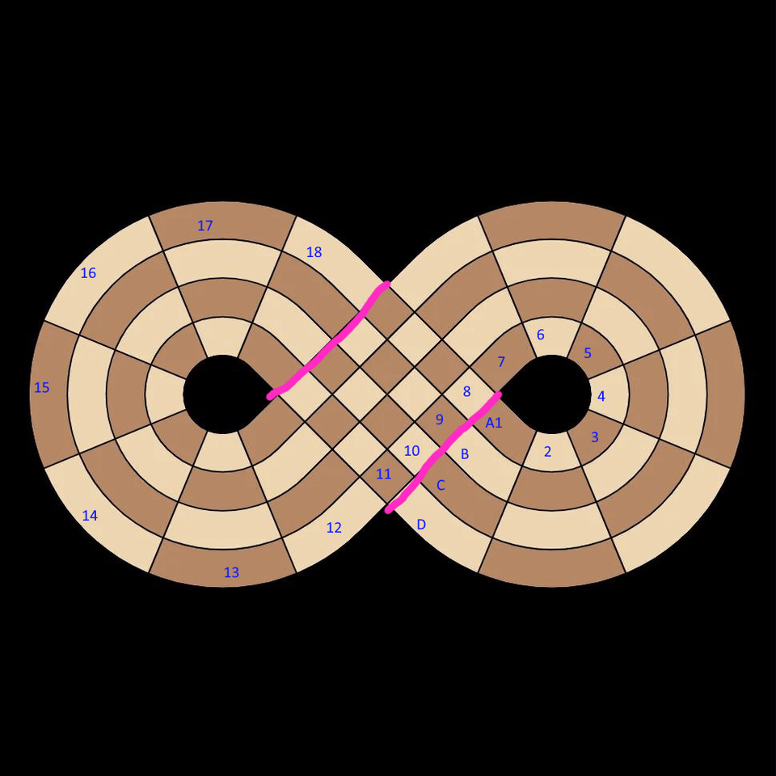

Here are visual examples of how pieces navigate the intersecting infinite loops:

### Starting Position
The game features an intricate starting position to populate the infinite loops, ensuring pieces are distributed across both the inner and outer rings.
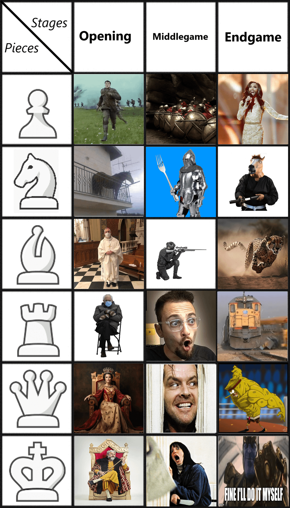

### Pawns
Pawns move forward along their loop but must "remember" their direction. En Passant is fully supported and follows standard logic translated to the curved grid.
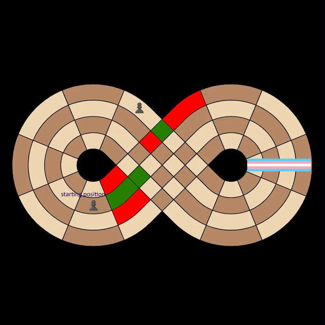

**En Passant Mechanics**:
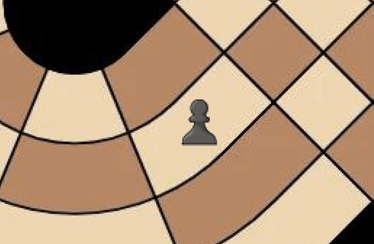
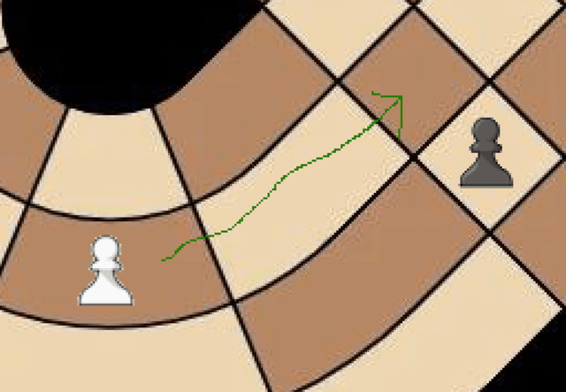
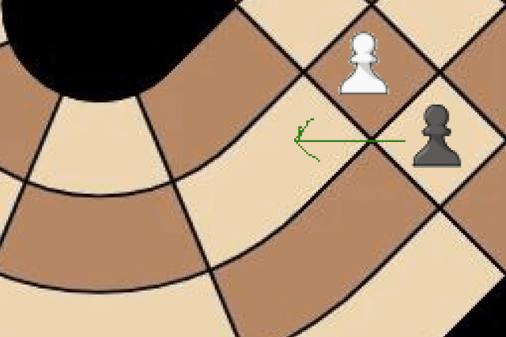

### Knights
Knights jump in an L-shape across the non-Euclidean curve.
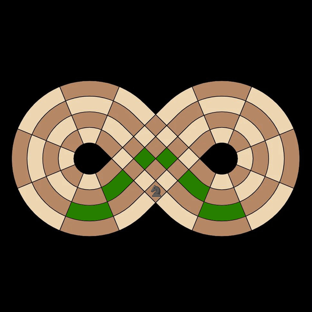
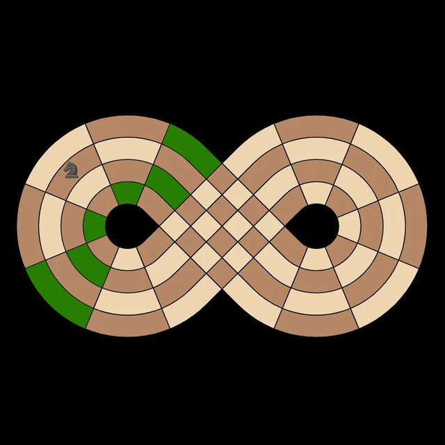

### Bishops
Bishops move diagonally but their paths are confined by the geometry and tile colors.
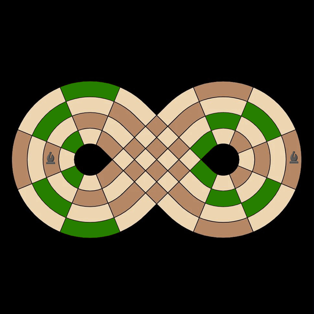
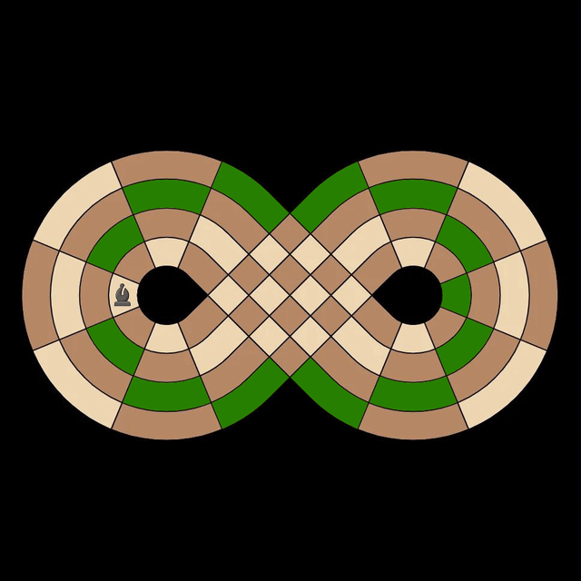
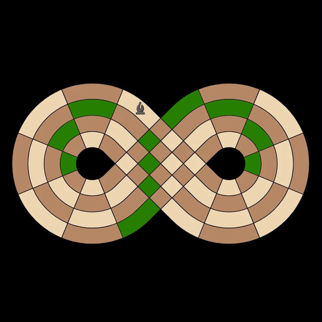

### Rooks
Rooks orbit the loops in straight lines without crossing diagonals.
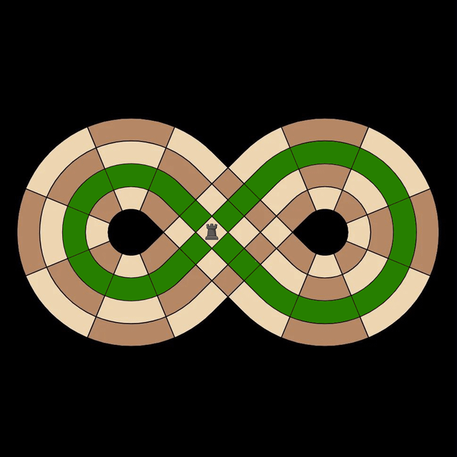
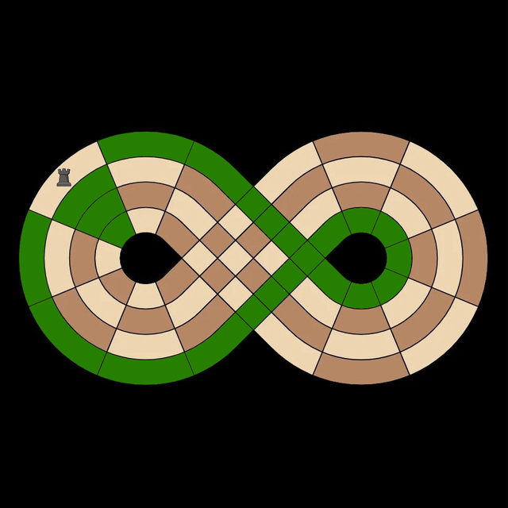

### Queens
Queens combine Rook and Bishop movements, capable of traversing both loops and diagonals.
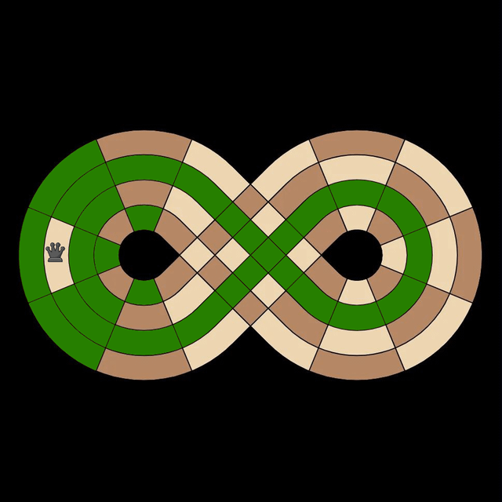
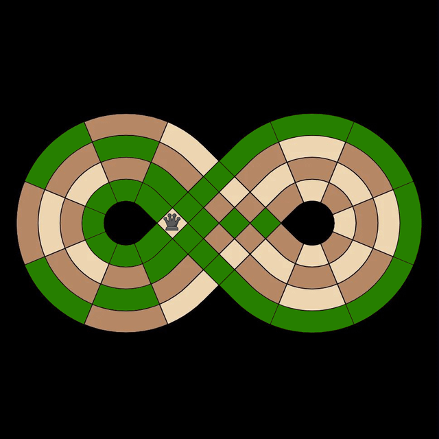

### Kings
Kings can move one tile in any direction, effectively transitioning paths seamlessly at intersections.
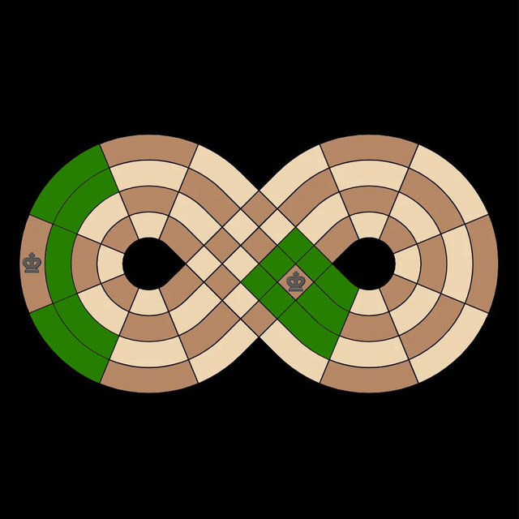

