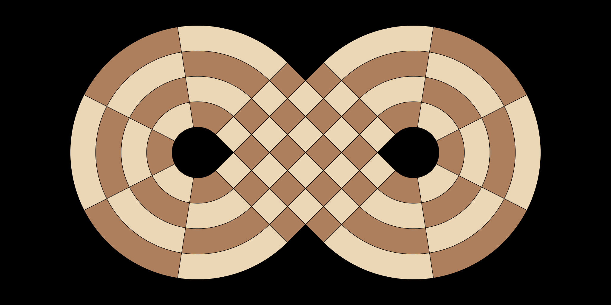
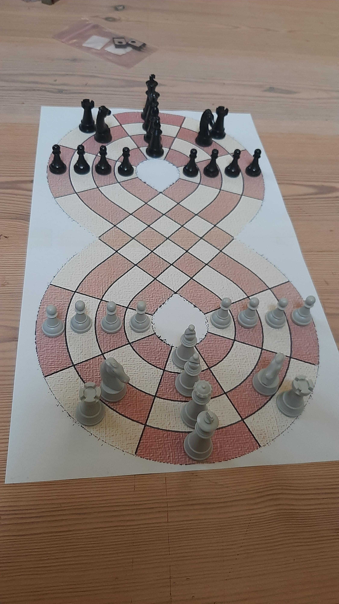

# Infinite Chess

A chess variant played on a lemniscate (figure-eight) board, where pieces can orbit the loops.

## Features
- **Modern Tech Stack**: React (TypeScript) + Django Channels in a Unified Monorepo.
- **Anonymous Matchmaking**: Real-time pairing without user accounts.
- **Infinite Topology**: A board where straight lines can return to their origin.

## Architecture: Flat Source Monorepo

This project follows a "Flat Source" monorepo structure where the core logic, backend server, and frontend UI live together in a single, unified environment.

```text
infinite-chess/
├── pyproject.toml         # Unified Python dependencies (Logic + Server)
├── package.json           # Unified Node dependencies (React + Vite)
├── src/                   # Universal Source Code
│   ├── board/             # [BACKEND] Pure Python Chess logic (The "Rules")
│   ├── server/            # [BACKEND] Django / Channels (The "Network")
│   └── frontend/          # [FRONTEND] React / Vite (The "UI")
├── tests/                 # Parallel Testing Suite
│   ├── board/             # Unit tests for the chess engine
│   └── server/            # Integration tests for the Django server
└── assets/                # Reference material and game assets
```

## Getting Started

### Prerequisites
- [uv](https://github.com/astral-sh/uv) for Python management.
- [Node.js](https://nodejs.org/) (npm) for frontend management.

### Installation & Run
1. **Sync Environment**: `uv sync`
2. **Install Frontend**: `npm install`
3. **Run Backend**: `uv run manage runserver`
4. **Run Frontend**: `npm run dev`

### Testing
- **All Tests**: `uv run pytest`
- **Logic Only**: `uv run pytest tests/board/`

## Movement Examples & Coordinate Geometry
The unique lemniscate shape alters the standard movement paths and coordinate geometry. 

### Manifold Topology
The board is a parity-corrected figure-eight manifold, ensuring a perfect checkerboard pattern even through the complex intersection.



### Coordinates
The board consists of 72 tiles defined by a polar-like coordinate system:
- **Rings (A-D)**: Lettered from the innermost ring (A) to the outermost ring (D).
- **Slices (1-18)**: Numbered sequentially around the infinity loop, starting near the center intersection. Slices 1-7 wrap around the right hole, 8-11 traverse the intersection, and 12-18 wrap around the left hole.


Here are visual examples of how pieces navigate the intersecting infinite loops:

### True Starting Position
The game features an intricate starting position to populate the infinite loops, ensuring pieces are distributed symmetrically in a wedge formation. The Rooks and Knights flank the Pawns on the outer rings, while the King, Queen, and Bishops line up in a single radial slice pointing toward the intersection. 

*(Note: Due to the complex geometric nature of this layout, standard castling rules are currently not supported in this variant.)*


## Game Rules
- **The Board**: A 72-tile lemniscate board with 4 rings (A-D) and 18 slices.
- **True Starting Position**: Pieces are symmetrically mirrored across the two loops (White on Slice 13, Black on Slice 4).
- **Topology**: Slice 9 and Slice 18 physically cross, allowing specialized movement through the center.
- **Pawns**: 10-step promotion to Queen.
- **Bishops**: Confined to their color complex paths.
- **Mandatory En Passant**: If possible, it must be taken.
- **No Castling**: Not supported in this wedge geometry.

### Pawns
Pawns move forward along their loop but must "remember" their direction. En Passant is fully supported and follows standard logic translated to the curved grid.


**En Passant Mechanics**:
Because of the board's shape, pawns can attack across "adjacent" tracks depending on their position. If a pawn moves two spaces forward from its initial position, skipping over a square that is attacked by an enemy pawn, that enemy pawn can capture it *En Passant*. The capturing pawn moves diagonally into the skipped square, and the captured pawn is removed from the board, even if the visual geometry makes this look like an attack across a void or intersection.


### Knights
Knights jump in an L-shape across the non-Euclidean curve.


### Bishops
Bishops move diagonally but their paths are confined by the geometry and tile colors.


### Rooks
Rooks orbit the loops in straight lines without crossing diagonals.


### Queens
Queens combine Rook and Bishop movements, capable of traversing both loops and diagonals.


### Kings
Kings can move one tile in any direction, effectively transitioning paths seamlessly at intersections.

