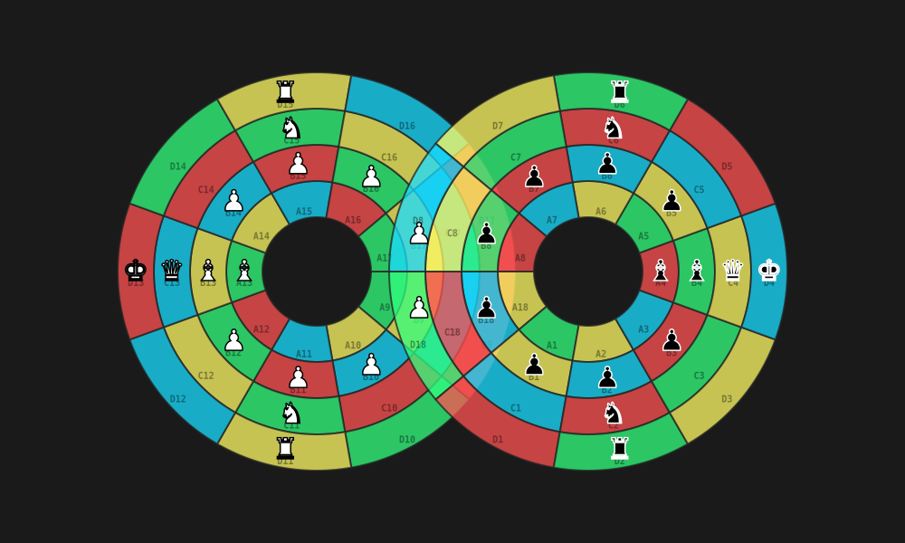
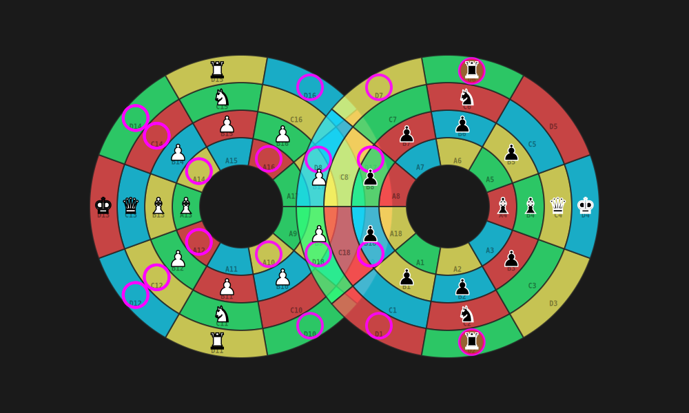

# Test Visualizations

This directory contains high-quality visual representations of board states and legal move generation to verify the engine's behavior, specifically mapped to the true Lemniscate figure-eight topology.

## Standard Starting Position

**IFEN (Infinite FEN):** `1p-2/1p-nr/1p-2/bbqk/1p+2/1p+nr/1p+2/1p+2/1P-2/1P-2/1P-NR/1P-2/BBQK/1P+2/1P+NR/1P+2/1P+2/1p-2 w -`

## Legal Moves from Start Position

The following image highlights all available legal moves for White (Turn: w) in the starting position.

### Legal Moves List (30 moves):
`C11->D9, C11->A10, C11->A12, D11->D6, D11->D7, D11->D8, D11->D9, D11->D10, D11->D12, B13->A12, B13->C12, B13->A14, B13->C14, C13->C12, C13->D12, C13->C14, C13->D14, D13->C12, D13->D12, D13->C14, D13->D14, C15->A14, C15->A16, C15->D17, D15->D1, D15->D2, D15->D14, D15->D16, D15->D17, D15->D18`
