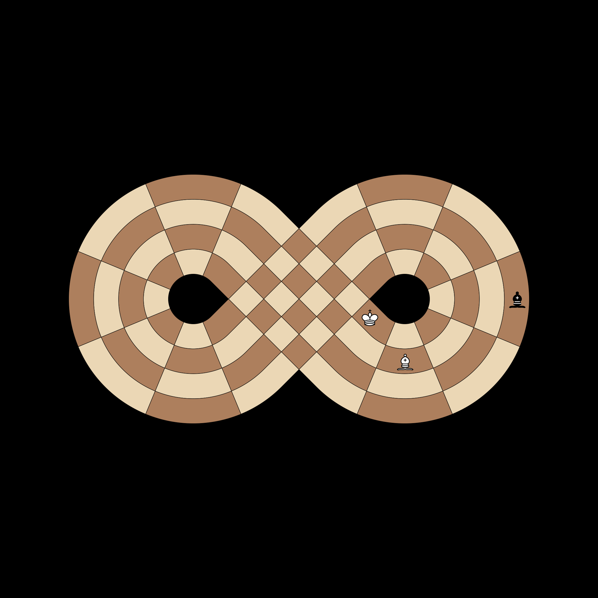

# Visual Test Cases

## Absolute Pin (Diagonal)
**Test**: `test_absolute_pin_diagonal` in `test_comprehensive.py`

**Description**: 
A Black Bishop at **D4** is pinning a White Bishop at **B2** against the White King at **A1**. 
Even on this non-Euclidean board, the diagonal remains a straight line through the manifold. 
The White Bishop at B2 can only move along the pin (to C3 or capture at D4) but cannot move to other squares like A3.

