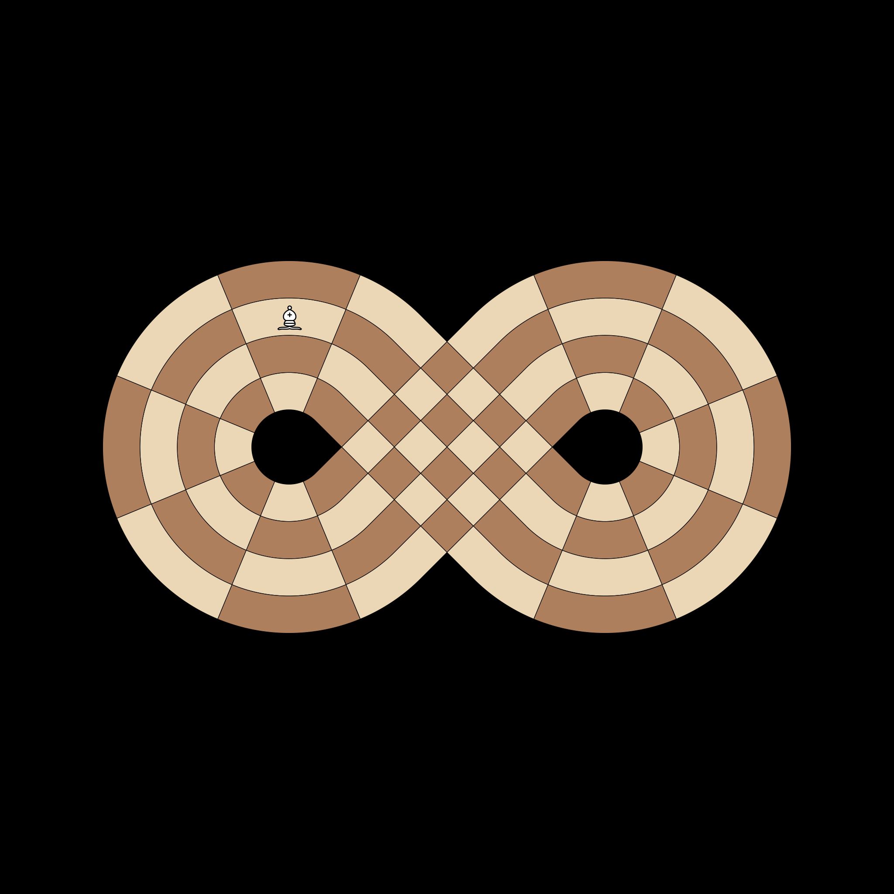

# Test Bishops

## [1] Bishop Intersection Path
**Test**: `test_bishop_b17_to_c6`

**Description**:
Bishops must be able to traverse the physical intersection between the two loops. Specifically, a Bishop at B17 should be able to reach C6 by following the diagonal topology.

**Pass Condition (Boolean Check)**:
Coordinate C6 is in the set of pseudo-legal moves for a Bishop at B17.

