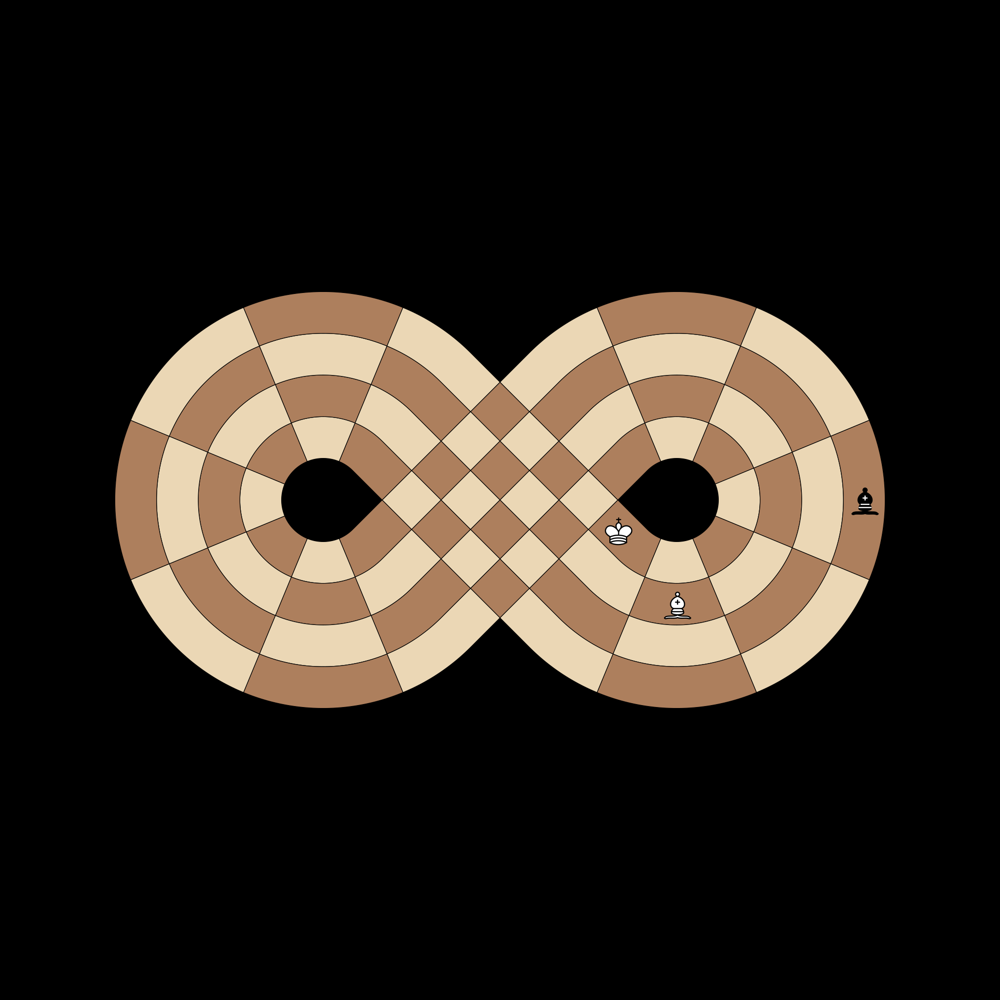
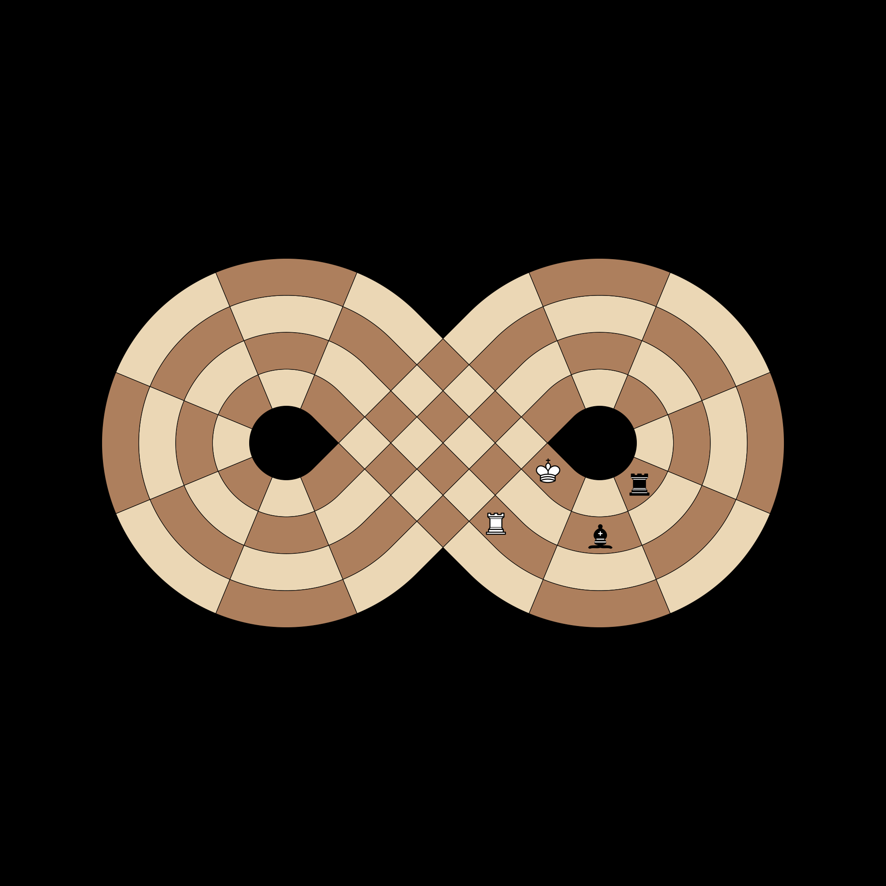
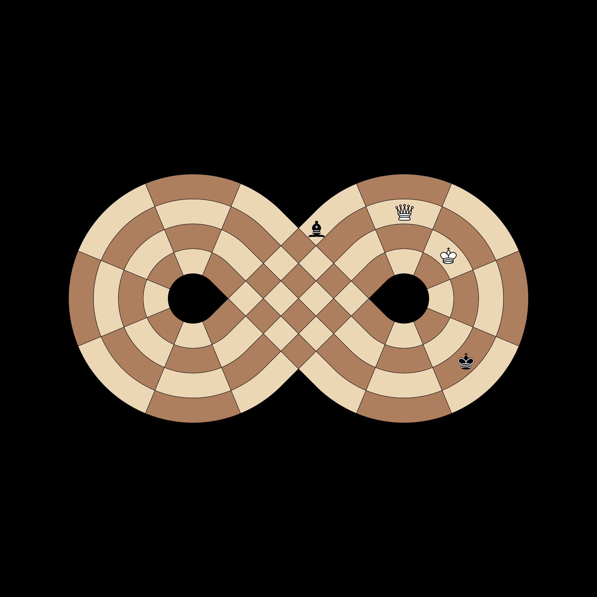
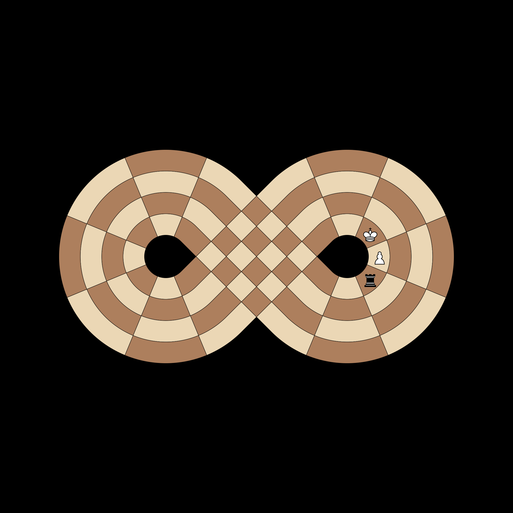

# Test Comprehensive

## [IC-COMP-001] Absolute Pin Diagonal
**Test**: `test_absolute_pin_diagonal`

**Description**:
A piece pinned to the King diagonally can only move along that diagonal.

**Pass Condition (Boolean Check)**:
Legal moves for the pinned Bishop are restricted to the diagonal.

## [IC-COMP-002] Double Check Evasion
**Test**: `test_double_check_forces_king_move`

**Description**:
When in double check, the only legal move is for the King to move.

**Pass Condition (Boolean Check)**:
Non-King pieces have zero legal moves during a double check.

## [IC-COMP-003] Pinned Piece Power
**Test**: `test_pinned_piece_projects_check`

**Description**:
A pinned piece still projects threat and can deliver check.

**Pass Condition (Boolean Check)**:
The enemy King is in check even if the checking piece is pinned.

## [IC-COMP-004] Around The World Advanced
**Test**: `test_around_the_world_check_advanced`

**Description**:
Blocking one path of a loop check doesn't necessarily block the other.

**Pass Condition (Boolean Check)**:
King remains in check if only one direction of the loop is blocked.

