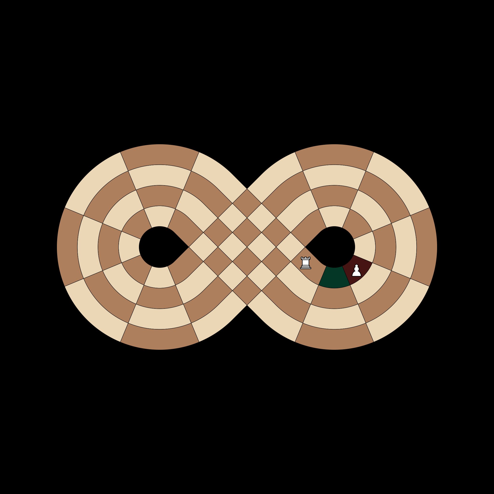
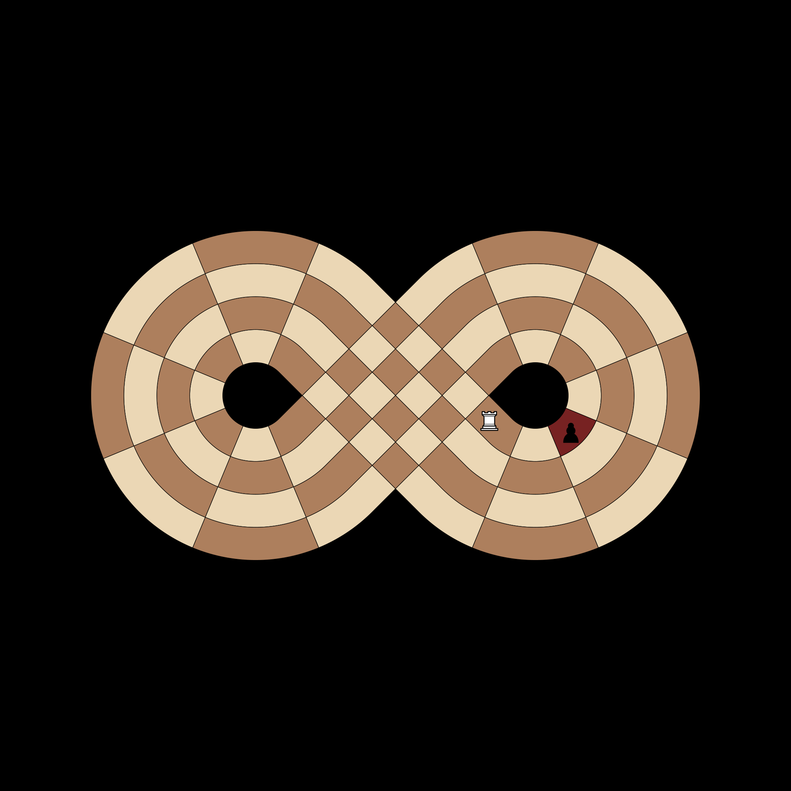

# Comprehensive Test Documentation

This file visualizes higher-level game rules like pins, checks, and collisions.

## Friendly Blocking
**Test**: `test_rook_blocked_by_friendly`

Ensures sliding pieces stop before squares occupied by friendly pieces. The square A2 is reachable, but A3 (occupied) and squares beyond it are not.

## Enemy Capturing
**Test**: `test_rook_capture_enemy`

Ensures sliding pieces can capture enemy units but cannot pass through them. The Rook can land on A3 (capture) but cannot reach A4.

## Absolute Pin (Diagonal)
**Test**: `test_absolute_pin_diagonal`

Visualizes a pin where the White Bishop at B2 cannot move off the diagonal because it would expose the King at A1 to the Black Bishop at D4.

## Double Check
**Test**: `test_double_check_forces_king_move`

When in double check, the only legal moves are King moves. Here, the White Rook at C1 has zero legal moves even though it could normally capture the Black Bishop.

