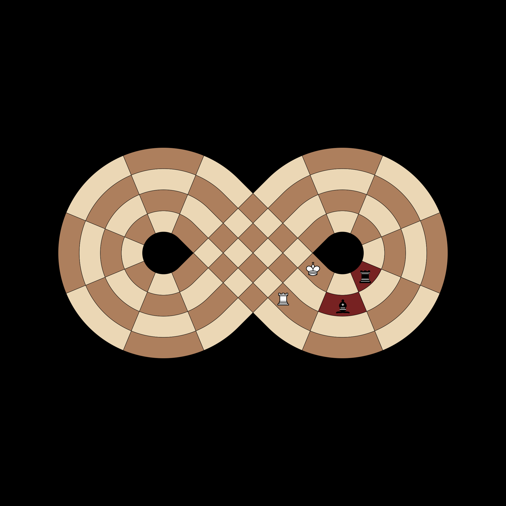
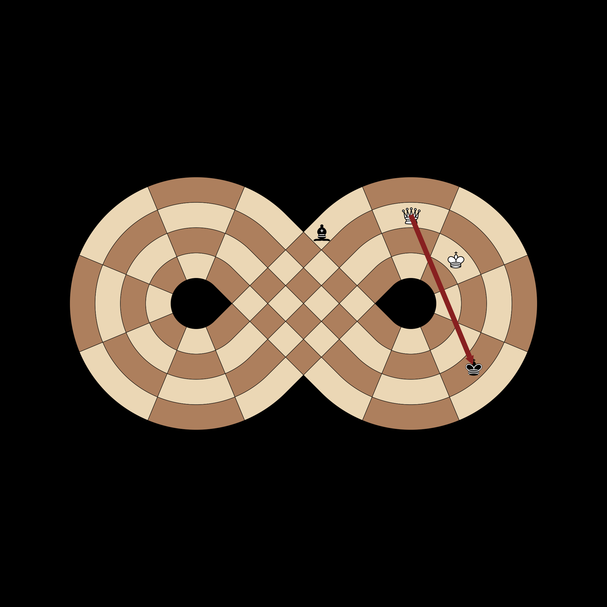

# Comprehensive Rule Documentation

This document visualizes complex game states involving multiple pieces, including pins, double checks, and threat projections. These tests ensure the 'Rules of Chess' are applied correctly to the figure-eight manifold.

## Absolute Pin (Diagonal)
**Test**: `test_absolute_pin_diagonal`

**Scenario**:
A Black Bishop at D4 is aiming directly at the White King at A1. A White Bishop is standing in the way at B2.

**Description**:
This is an 'Absolute Pin'. The White Bishop at B2 is protecting its King. It is legally allowed to move *along* the line of the attack (toward the attacker or toward the King), but it is strictly forbidden from moving *off* that line (like moving to A3), as that would leave the King in check. This test validates that the game rules recognize this complex restriction on a non-linear board.

**Pass Condition (Boolean Check)**:
The test confirms that while the Bishop has moves along the diagonal (C3 and D4), any moves that step off that specific diagonal are filtered out and marked as illegal.

## Double Check Evasion
**Test**: `test_double_check_forces_king_move`

**Scenario**:
The White King is being attacked by two different Black pieces at once: a Rook at A3 and a Bishop at B2. 

**Description**:
In chess, a 'Double Check' is extremely dangerous because you cannot block or capture two pieces with a single move. The *only* way to escape a double check is to move the King itself. This test checks that the game engine correctly identifies this state and disables all moves for other friendly pieces (like the White Rook at C1), even if they could normally capture one of the attackers.

**Pass Condition (Boolean Check)**:
The test verifies that the list of legal moves for the White Rook is empty, while the King still has valid escape options.

## Pinned Piece Power
**Test**: `test_pinned_piece_projects_check`

**Scenario**:
A White Queen is 'pinned' to its own King by a Black Bishop. This means the Queen cannot move. However, that Queen is also currently attacking the Black King.

**Description**:
A common rule confusion is whether a piece that is 'pinned' (cannot move) can still give check. The answer is YES. Even though the Queen is frozen in place, the Black King is still in danger. This test ensures that the engine correctly calculates threats even from immobile pieces.

**Pass Condition (Boolean Check)**:
The test confirms that the game correctly reports 'True' for the Black King being in check.

