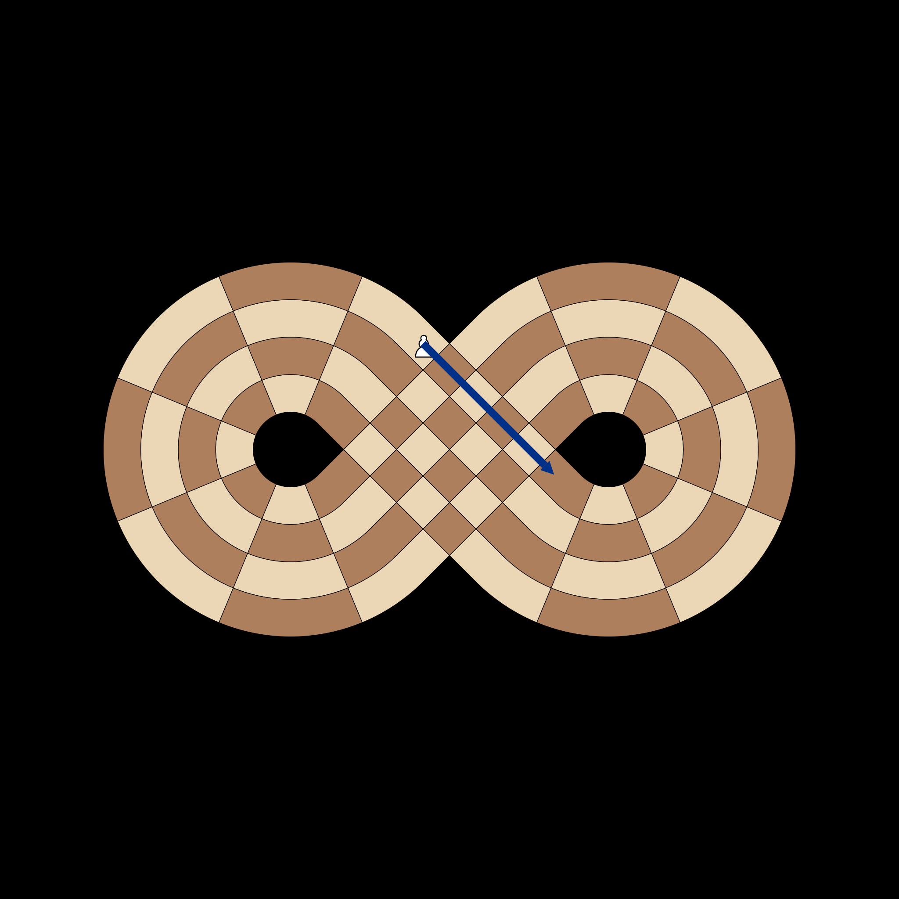

# Logic Test Documentation

This file visualizes the low-level movement math for each piece type.

## Rook Movement
**Test**: `test_rook_moves`

Validates that a Rook orbits the rings in a straight path. On an empty board, it can reach every other square on its current ring (17 squares) and every other ring on its current slice (3 squares), totaling 20 possible moves.

## Bishop Movement
**Test**: `test_bishop_moves`

Validates diagonal propagation through the figure-eight. Diagonals on this board correctly wrap and transition between rings, maintaining the checkerboard complex.

## Knight Movement
**Test**: `test_knight_moves`

Validates the L-shape jump. Note how the knight can jump across the 1/18 Rank boundary (e.g., from B2 to A18 or C18).

## King Intersection Pathing
**Test**: `test_king_moves`

Validates that the King can step across the physical intersection. A King at Slice 9 can move to adjacent squares in its loop OR jump to its twin square at Slice 18.

## Pawn Wrapping
**Test**: `test_pawn_moves`

Validates that pawns correctly transition from Rank 18 to Rank 1 (or vice versa) while maintaining their forward momentum along the track.

