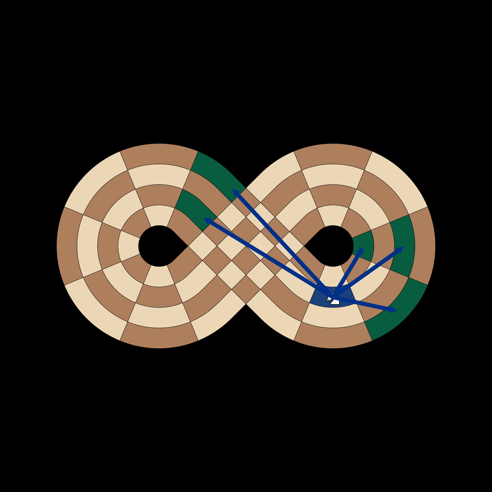
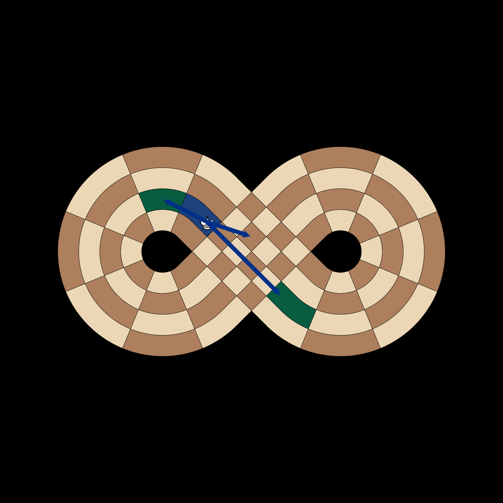

# Logic Test Visuals (`test_logic.py`)

## Knight Moves wrapping around the loop
**Test**: `test_knight_moves`
A White Knight at **B2** jumping to wrap-around targets.

## King Intersection Jump
**Test**: `test_king_intersection_jump`
A King at **C18** jumping across the figure-eight intersection to **C9**.

