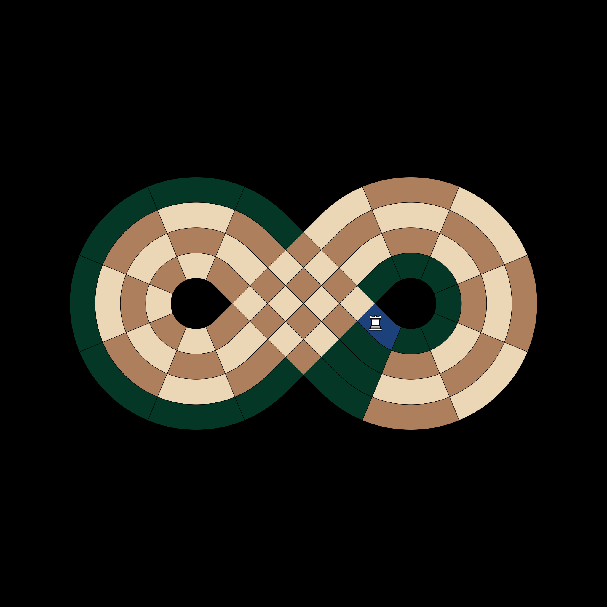
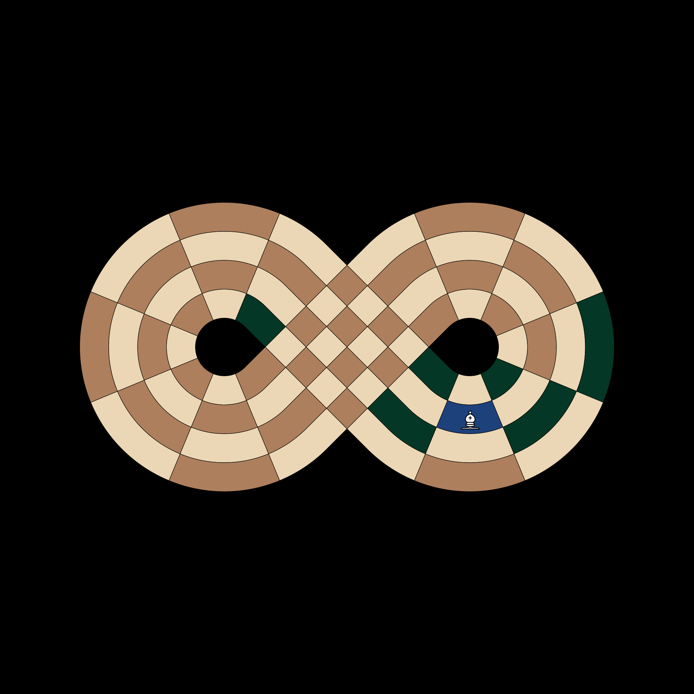
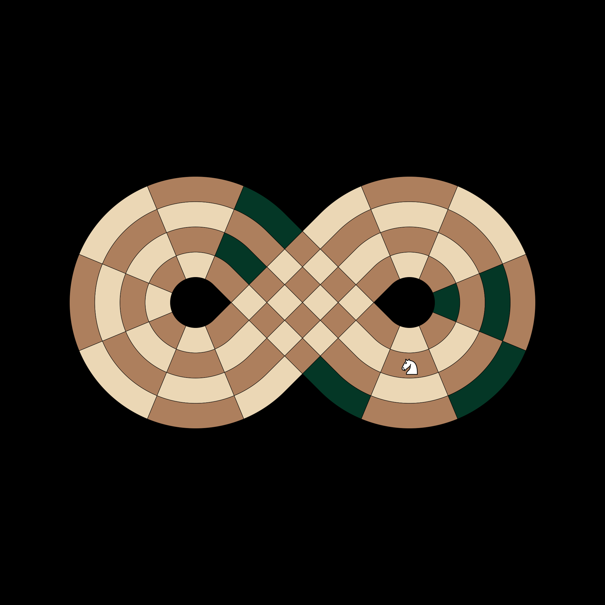
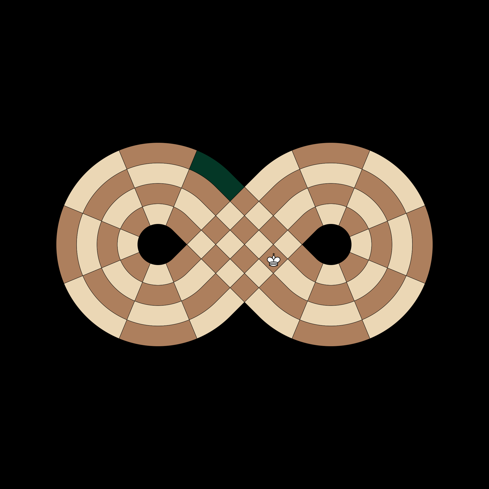

# Logic Test Documentation (Core Piece Math)

This document provides a visual guide for the fundamental mathematical rules of piece movement on the figure-eight board. These tests ensure that pieces 'know' how to navigate the curved tracks and the central intersection correctly.

## Rook Movement Math
**Test**: `test_rook_moves`

**Scenario**: 
We place a single White Rook on the innermost ring (Ring A) at the first slice. In this unique geometry, a 'straight line' for a Rook means either staying on its current circular track or moving radially across the tracks at a single point. 

**Description**:
The Rook should be able to orbit the entire loop it is currently on. Since there are 18 slices in total, there are 17 other squares on its current ring it can reach. Additionally, it can move to any of the other 3 rings at its current slice (Rings B, C, and D). This test validates that the underlying 'radial' and 'orbital' math correctly identifies all 20 possible destinations without getting lost in the curve.

**Pass Condition (Boolean Check)**:
The test confirms that the movement engine returns exactly 20 valid squares and specifically verifies that the Rook is not allowed to 'move' to the square it is already occupying.

## Bishop Movement Math
**Test**: `test_bishop_moves`

**Scenario**: 
We place a White Bishop on Ring B at Slice 2. Diagonals are the most complex paths on a figure-eight board because they must 'zig-zag' between the circular tracks while maintaining a consistent color complex (like staying only on light squares).

**Description**:
This test validates that the Bishop can correctly calculate its X-shaped paths. It checks that the Bishop can move 'outward' to Ring C/D while moving forward/backward along the loop, and 'inward' to Ring A. This ensures that the 'diagonal' isn't broken by the fact that the board is curved.

**Pass Condition (Boolean Check)**:
The test checks for specific expected squares (like C3 and A1) and ensures that 'illegal' non-diagonal squares (like the one directly next to it on the same ring) are strictly excluded from the results.

## Knight Movement Math
**Test**: `test_knight_moves`

**Scenario**:
We place a White Knight on Ring B at Slice 2. Knights move in an 'L' shape: two squares in one cardinal direction and then one square perpendicular.

**Description**:
On a looped board, the 'L' shape can sometimes wrap around the start/end boundary. For example, moving 'backward' from Slice 2 might land the Knight on Slice 18 or 17. This test ensures the Knight doesn't 'fall off the edge' of the coordinate system and correctly finds its targets on the other side of the Rank 1/18 line.

**Pass Condition (Boolean Check)**:
The test validates that the Knight can successfully jump to specific coordinates like C4 and A18, proving that the coordinate wrapping (18 becoming 1) is handled correctly during piece movement.

## King Intersection Logic
**Test**: `test_king_moves`

**Scenario**:
We place a White King at Slice 9, which is one of the two 'junction' points where the figure-eight physically crosses itself.

**Description**:
In this variant, the King has a special ability: when standing at one of the intersection points (Slice 9 or Slice 18), it can 'step' across the void to the opposite side of the intersection. This effectively treats the two distant points on the map as if they were touching. This test validates that the King can move to its normal neighbors (8 and 10) AND its 'teleport' neighbor (18).

**Pass Condition (Boolean Check)**:
The test ensures that the coordinate for the opposite side of the loop (A18) is included in the King's list of reachable squares.

