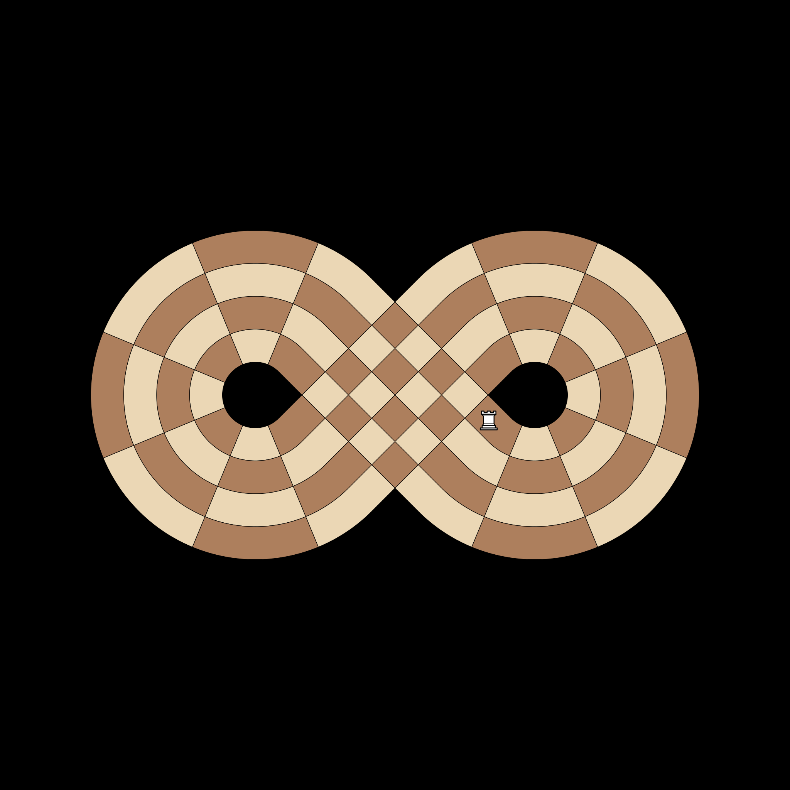
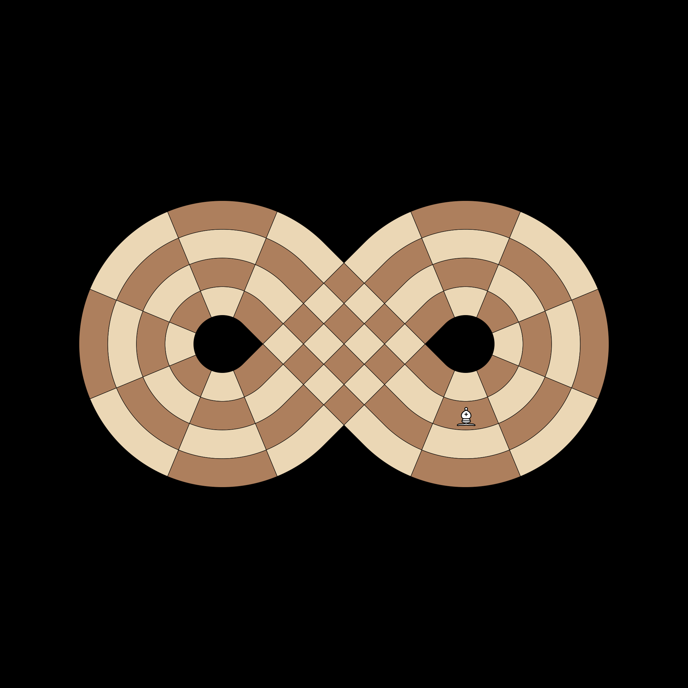
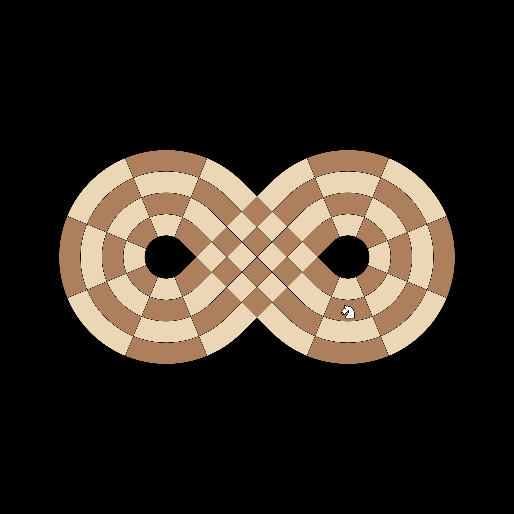
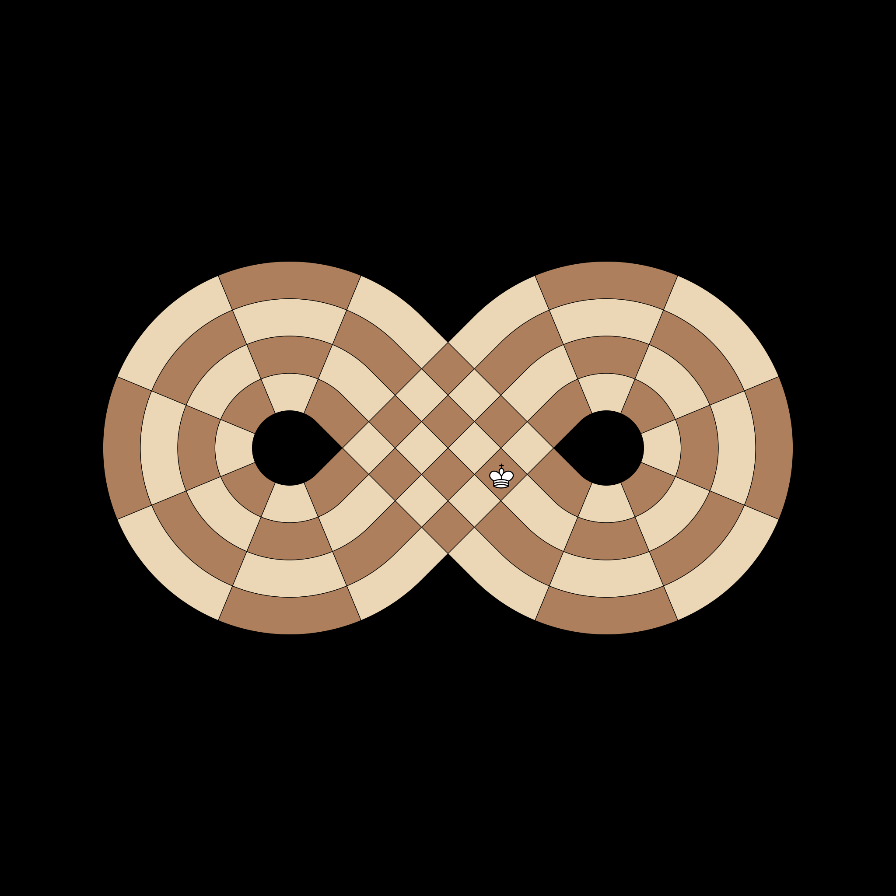
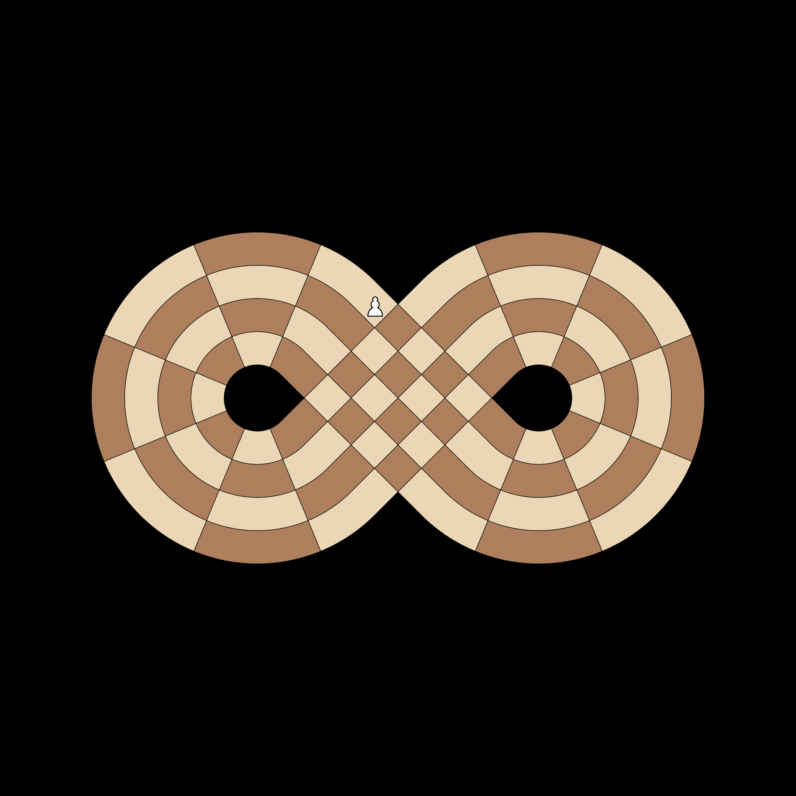

# Test Logic

## [IC-LOG-001] Rook Movement Geometry
**Test**: `test_rook_moves`

**Description**:
Test that Rooks move along rings and slices on an empty board.

**Pass Condition (Boolean Check)**:
Rook moves to adjacent rings and wraps around the same ring.

## [IC-LOG-002] Bishop Diagonal Geometry
**Test**: `test_bishop_moves`

**Description**:
Test that Bishops move along diagonals, changing both ring and slice.

**Pass Condition (Boolean Check)**:
Bishop moves diagonally to adjacent rings and slices.

## [IC-LOG-003] Knight L-Shape Jumps
**Test**: `test_knight_moves`

**Description**:
Test Knight movement on the curved manifold.

**Pass Condition (Boolean Check)**:
Knight performs valid L-shaped jumps, including wrapping.

## [IC-LOG-004] King Intersect Jump
**Test**: `test_king_moves`

**Description**:
Test King movement across the physical intersection (Slice 9 to 18).

**Pass Condition (Boolean Check)**:
King can jump directly from Slice 9 to Slice 18.

## [IC-LOG-005] Pawn Forward Step
**Test**: `test_pawn_moves`

**Description**:
Test Pawn movement following the loop direction.

**Pass Condition (Boolean Check)**:
Pawn moves one step forward and wraps correctly.

