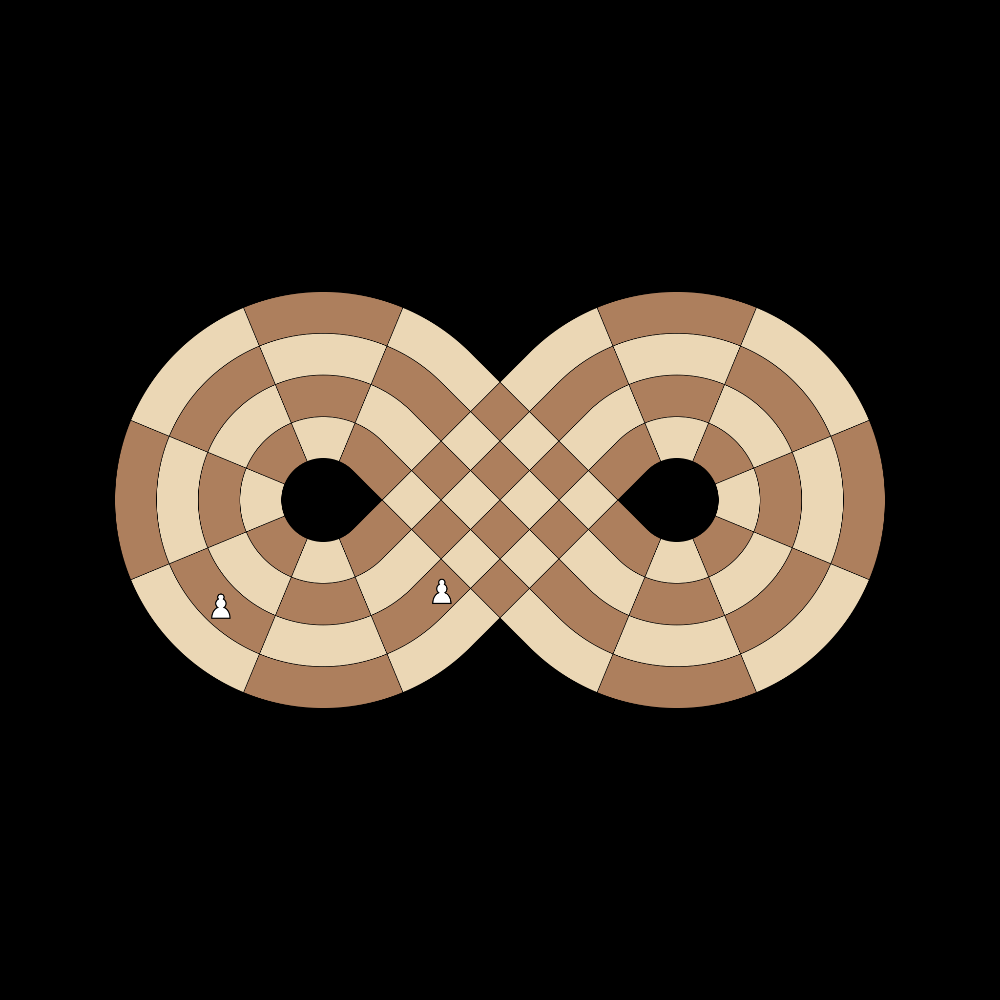
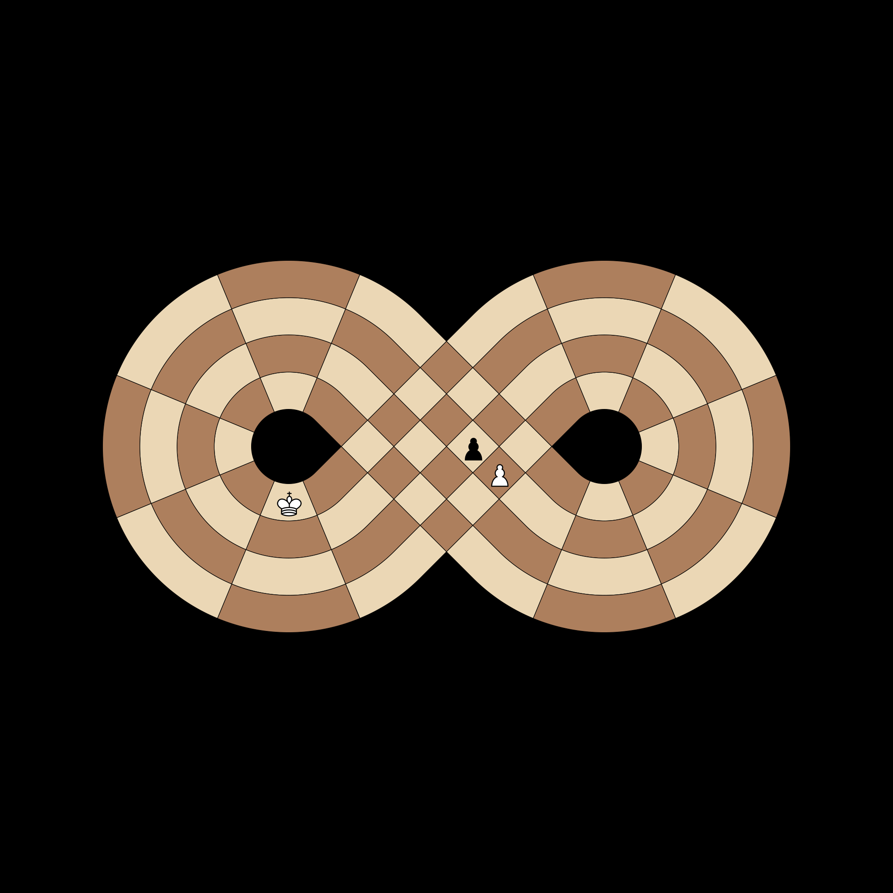
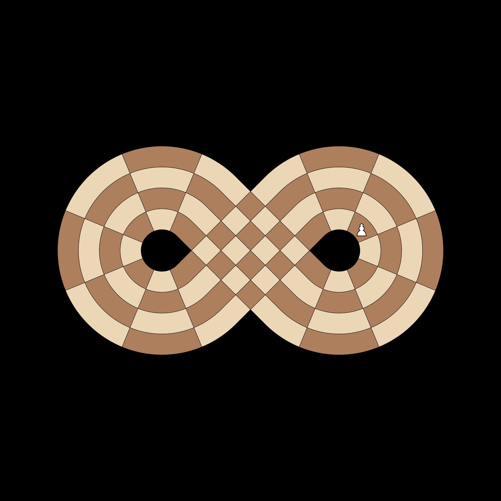
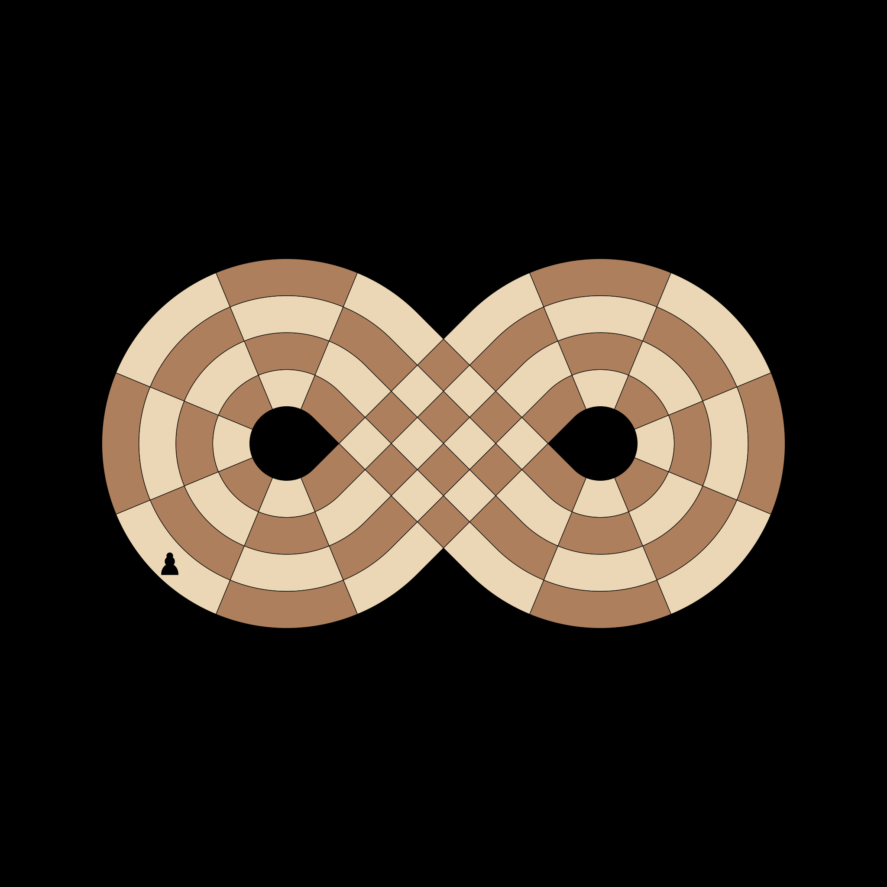
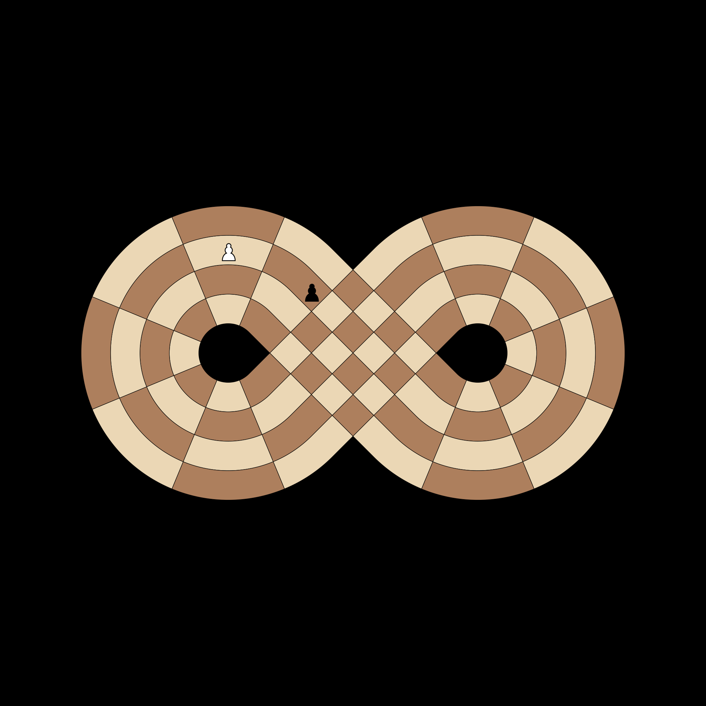

# Test Pawns

## [IC-PAWN-001] Pawn Direction Towards Center
**Test**: `test_pawn_direction_towards_center`

**Description**:
Pawns must move towards the center crossing (Slices 9/18). White pawns from 9-12 move -1, while those from 14-17 move +1.

**Pass Condition (Boolean Check)**:
Pawns only generate moves in their assigned direction towards the crossing.

## [IC-PAWN-002] Valid En Passant (Towards Center)
**Test**: `test_en_passant_valid_direction`

**Description**:
A White pawn moving -1 towards Slice 9 captures a Black pawn that double-pushed +1 towards Slice 9.

**Pass Condition (Boolean Check)**:
En Passant is possible when both pawns are moving towards their meeting point.

## [IC-PAWN-003] White Pawn Promotion (4th Rank)
**Test**: `test_white_pawn_promotion`

**Description**:
White pawns promote when they reach the 4th rank (Slice 4), which is the heart of the Black territory.

**Pass Condition (Boolean Check)**:
A White pawn move to Slice 4 includes a promotion to Queen.

## [IC-PAWN-004] Black Pawn Promotion (15th Rank)
**Test**: `test_black_pawn_promotion`

**Description**:
Black pawns promote when they reach the 15th rank (Slice 15), effectively breaching the White back rank.

**Pass Condition (Boolean Check)**:
A Black pawn move to Slice 15 includes a promotion to Queen.

## [IC-PAWN-005] Head-On Pawn Collision
**Test**: `test_pawn_head_on_collision`

**Description**:
Two pawns from different loops meeting head-on at the intersection must block each other.

**Pass Condition (Boolean Check)**:
Neither pawn can move forward into the occupied square.

