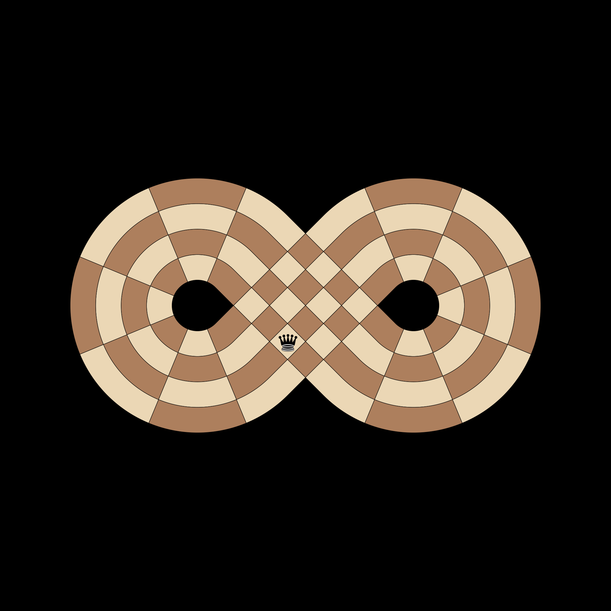
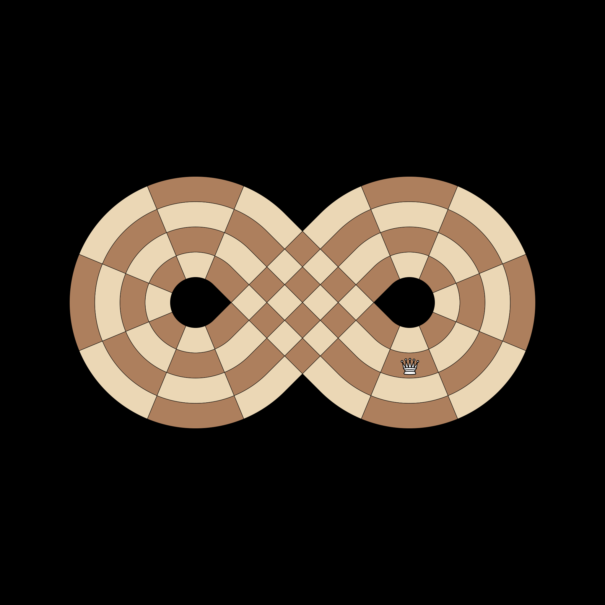
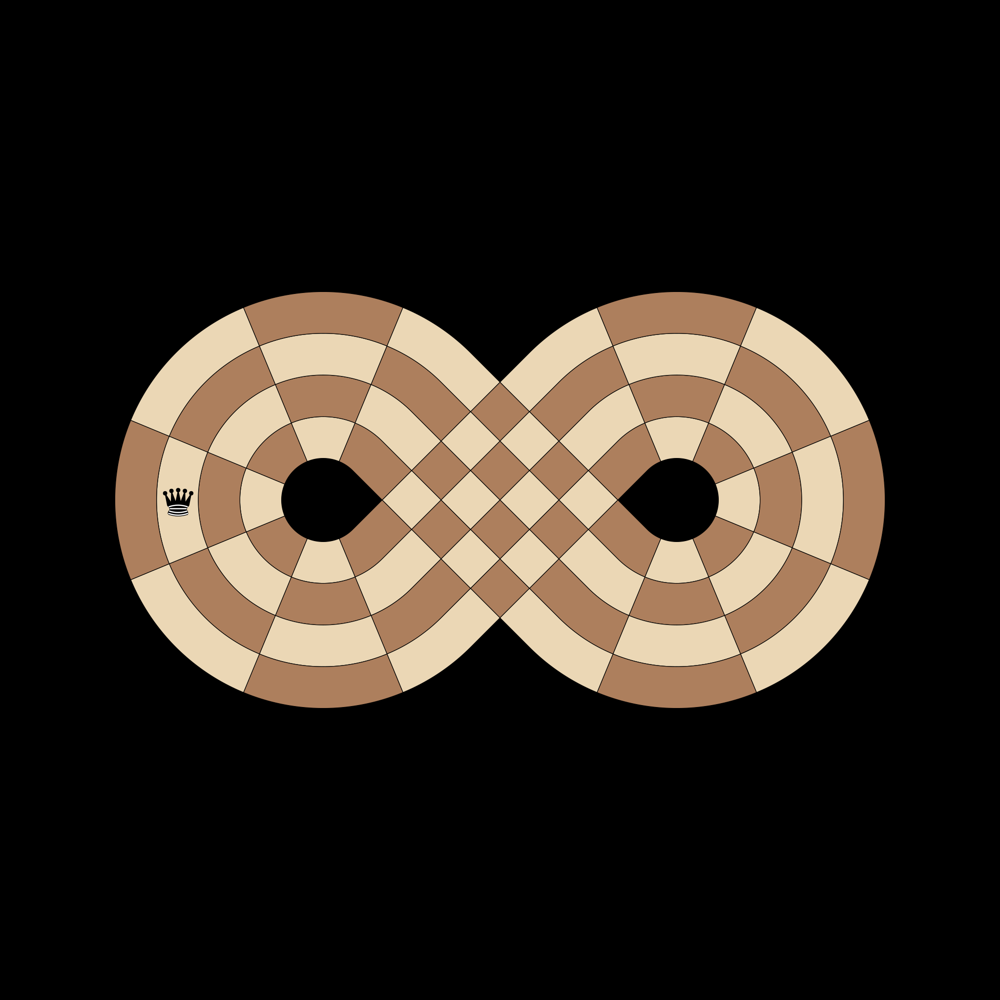

# Test Pawns

## [IC-PAWN-001] White Forward Path Logic
**Test**: `test_white_forward_path`

**Description**:
White 'Forward' pawns start at Slice 17 and move UP (+1) towards Slice 4. They should never hit Slices 13-16 or 12.

**Pass Condition (Boolean Check)**:
White Forward pawn path is 17->18->1->2->3->4(Promote).

## [IC-PAWN-002] Black Backward Path Logic (Mirror)
**Test**: `test_black_backward_path`

**Description**:
Black 'Backward' pawns start at Slice 3 and move DOWN (-1) towards Slice 13. They mirror the White Forward path but continue past the White base.

**Pass Condition (Boolean Check)**:
Black Backward pawn path is 3->2->1->18->17->16->15->14->13(Promote).

## [IC-PAWN-003] White Pawn Forbidden Zone
**Test**: `test_white_pawn_forbidden_zone`

**Description**:
White pawns are strictly forbidden from entering Slices 14, 15, and 16, as these are behind their movement vector.

**Pass Condition (Boolean Check)**:
No White pawn can generate a move that lands on Slice 14, 15, or 16.

## [IC-PAWN-004] Black Pawn Forbidden Zone (Mirror)
**Test**: `test_black_pawn_forbidden_zone`

**Description**:
Black pawns are strictly forbidden from entering Slices 1, 2, and 3.

**Pass Condition (Boolean Check)**:
No Black pawn can generate a move that lands on Slice 1, 2, or 3.

