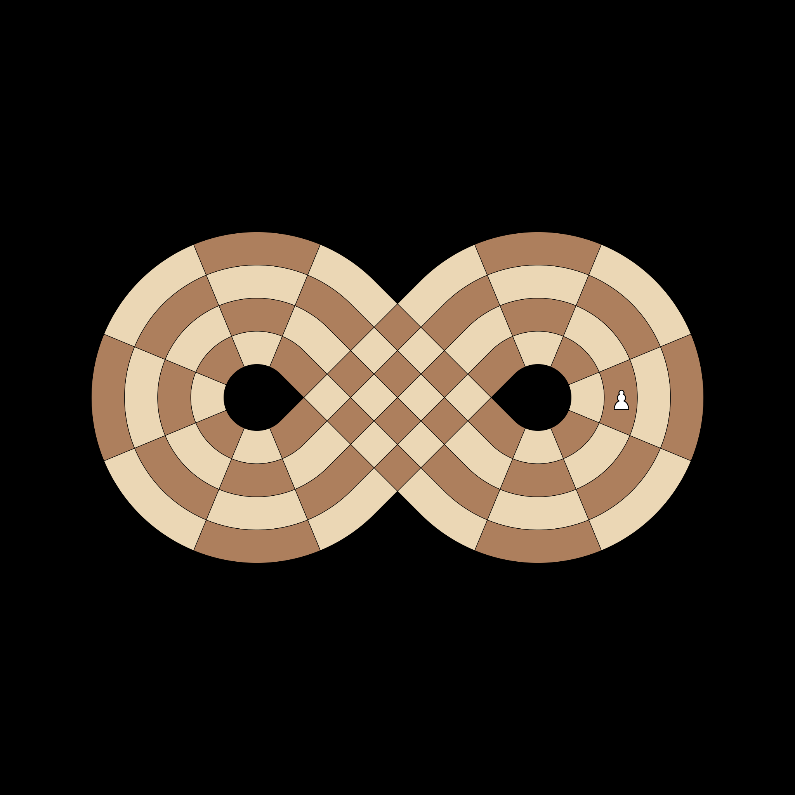
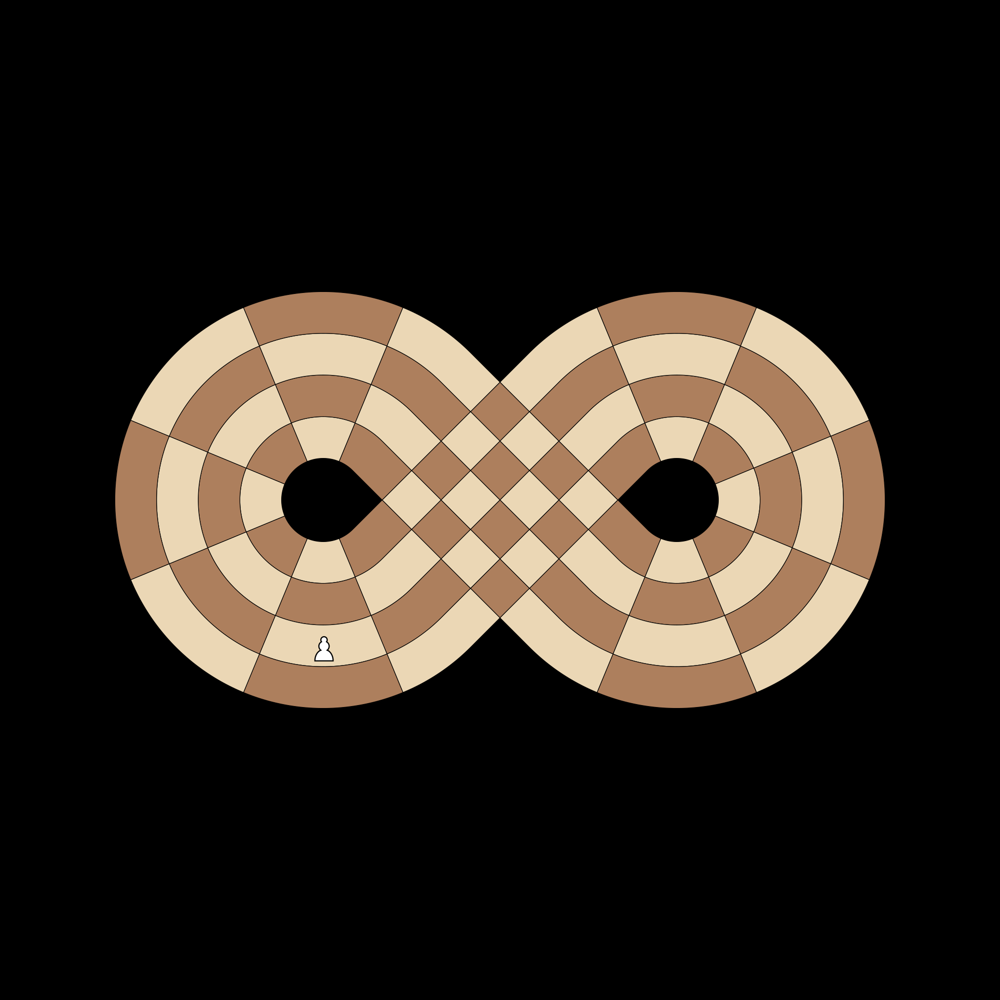
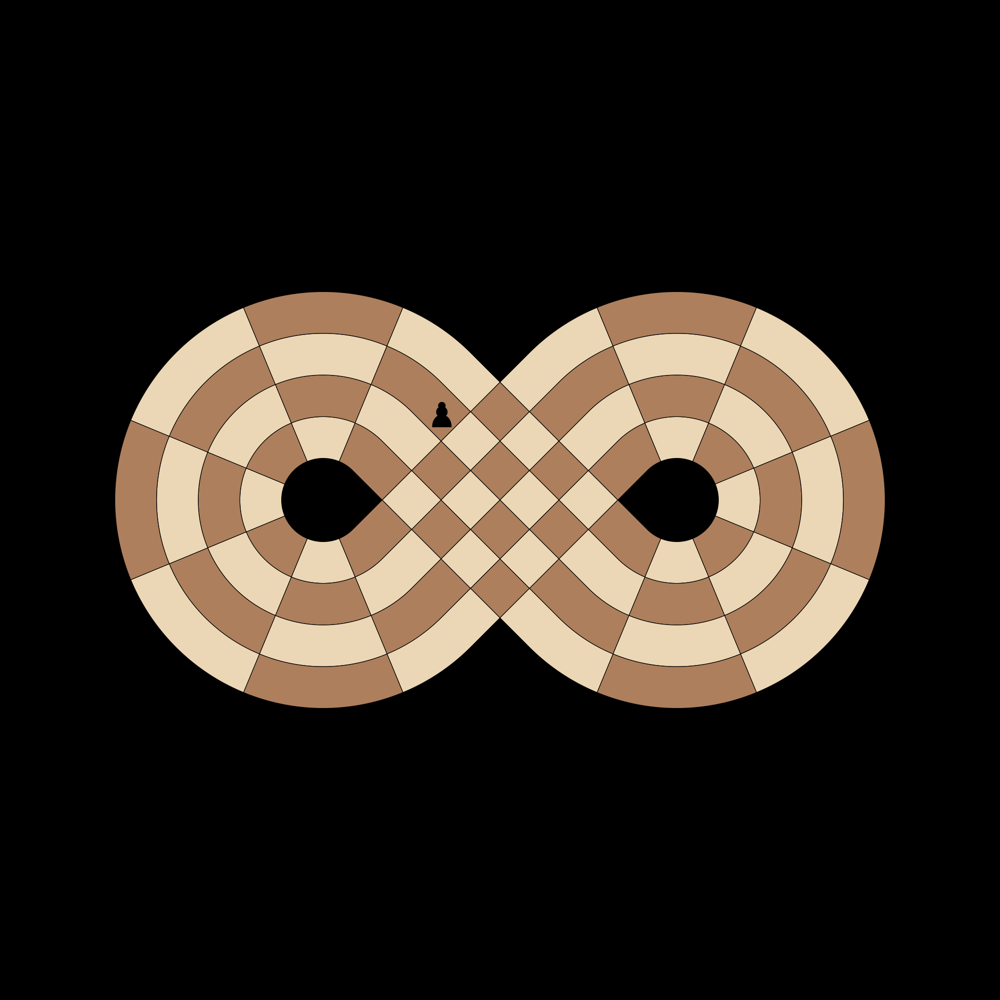
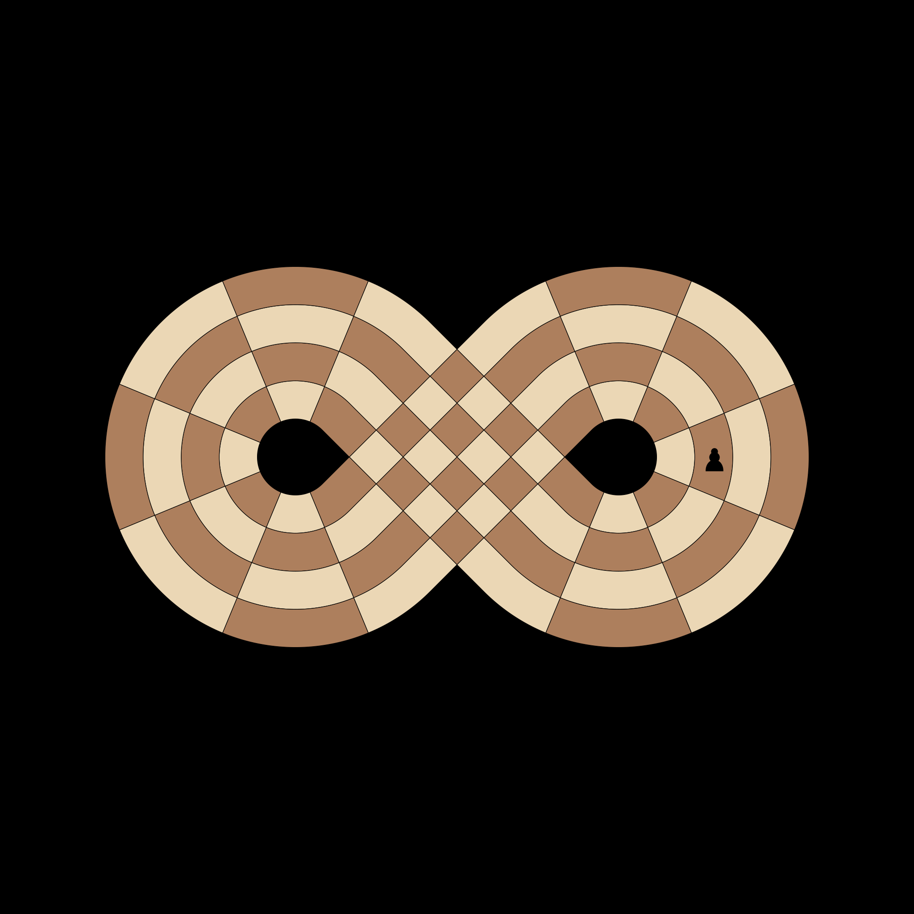

# Test Pawns

## [IC-PAWN-001] White Forward Path (Avoids Own Base)
**Test**: `test_white_forward_path`

**Description**:
White 'Forward' pawns start at Slice 17 and move UP (+1) towards Slice 4. They must skip Slices 12-16 to avoid their own base and back rank.

**Pass Condition (Boolean Check)**:
White Forward pawn path is 17->18->1->2->3->4(Promote).

## [IC-PAWN-002] White Base Pawn Path
**Test**: `test_white_base_pawn_path`

**Description**:
White pawns starting at the base (Slice 13) must move DOWN (-1) towards Slice 4 to avoid forbidden slices 14-16.

**Pass Condition (Boolean Check)**:
White Base pawn path is 13->12->11->10->9->8->7->6->5->4(Promote).

## [IC-PAWN-003] Black Mirror Forward Path
**Test**: `test_black_forward_path`

**Description**:
Black 'Forward' pawns start at Slice 18 (mirror of White 17) and move DOWN (-1) towards Slice 15. They must skip Slices 4-1 to avoid their own base.

**Pass Condition (Boolean Check)**:
Black Forward pawn path is 18->17->16->15(Promote).

## [IC-PAWN-004] Black Base Pawn Path
**Test**: `test_black_base_pawn_path`

**Description**:
Black pawns starting at their base (Slice 4) must move UP (+1) towards Slice 15.

**Pass Condition (Boolean Check)**:
Black Base pawn path is 4->5->6->7->8->9->10->11->12->13->14->15(Promote).

## [IC-PAWN-005] Head-On Pawn Collision
**Test**: `test_pawn_head_on_collision`

**Description**:
Two pawns from different loops meeting head-on at the intersection must block each other.

**Pass Condition (Boolean Check)**:
Neither pawn can move forward into the occupied square.

