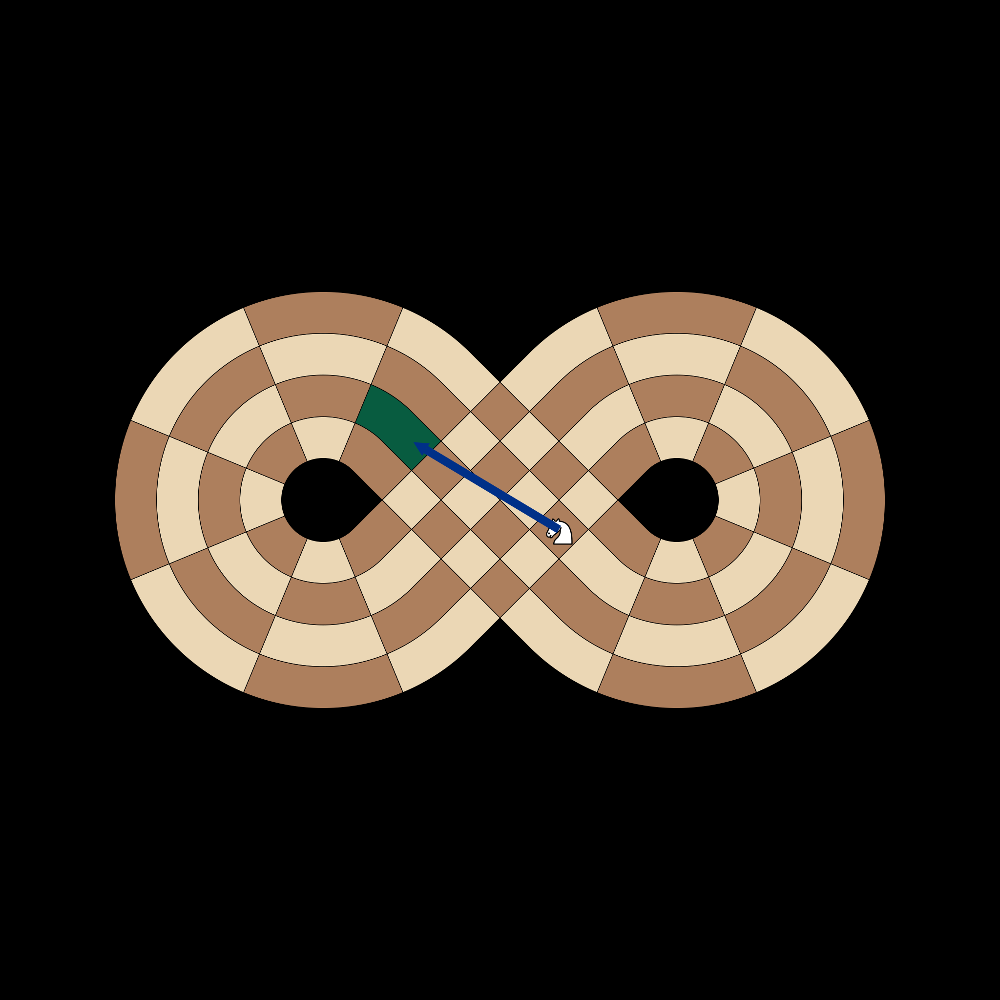
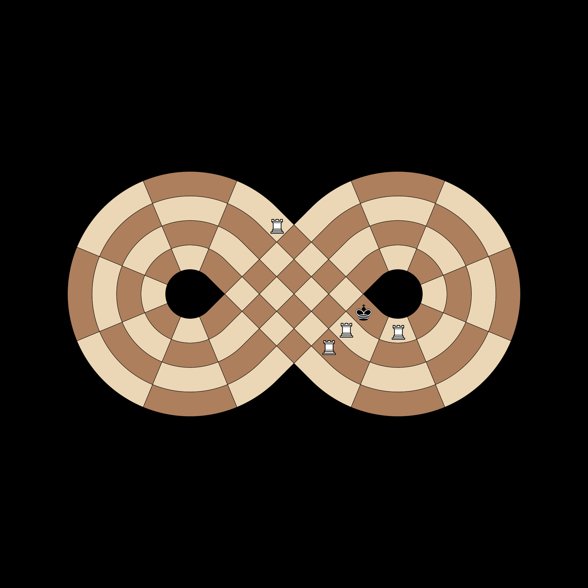
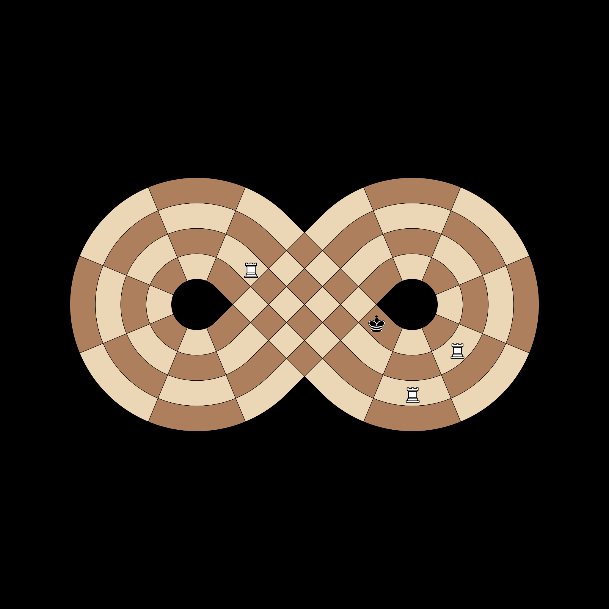

# TDD Failure Case Documentation

Visual documentation for advanced features and expected failure cases during development.

## Knight Lemniscate Jump (The 'Wormhole')
**Test**: `test_knight_true_lemniscate_jump`

Because Slice 9 and 18 physically cross, a Knight's L-shape can bridge the gap between these opposing tracks. This test validates the 'physically adjacent' knight jump across the manifold intersection.

## Checkmate Visualization
**Test**: `test_is_checkmate`

A King at A1 is completely surrounded by White Rooks. Every adjacent square is controlled, and the King is in check.

## Stalemate Visualization
**Test**: `test_is_stalemate`

The King at A1 is NOT in check, but all surrounding squares (A2, B2, A18, B18) are controlled by White Rooks from a distance.

