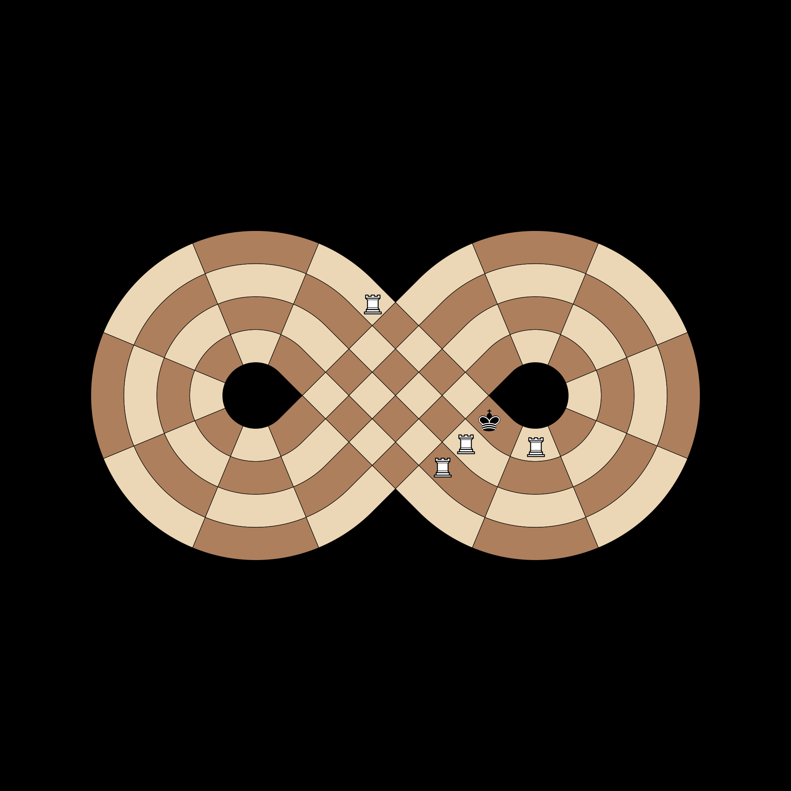

# Test Tdd Failures

## [20] Bishop Color Constraint
**Test**: `test_bishop_color_constraint`

**Description**:
Bishops must strictly alternate between two specific colors of the 4-color tiling.

**Pass Condition (Boolean Check)**:
All moves for a Bishop land on its allowed color complex.

## [21] Checkmate Recognition
**Test**: `test_is_checkmate`

**Description**:
The engine must correctly identify when the King is trapped in check.

**Pass Condition (Boolean Check)**:
is_checkmate returns True when no legal escape exists.

## [22] Knight Wormhole Jump
**Test**: `test_knight_true_lemniscate_jump`

**Description**:
Knights can jump across the physical intersection between Slice 9 and 18.

**Pass Condition (Boolean Check)**:
Knight at A9 has a legal jump to C18 across the intersection.

## [23] Pawn Promotion (10 Steps)
**Test**: `test_pawn_10_space_promotion`

**Description**:
Pawns must travel exactly 10 spaces on the figure-eight track to promote.

**Pass Condition (Boolean Check)**:
Promotion is only available when moves_made is 9 or more.

